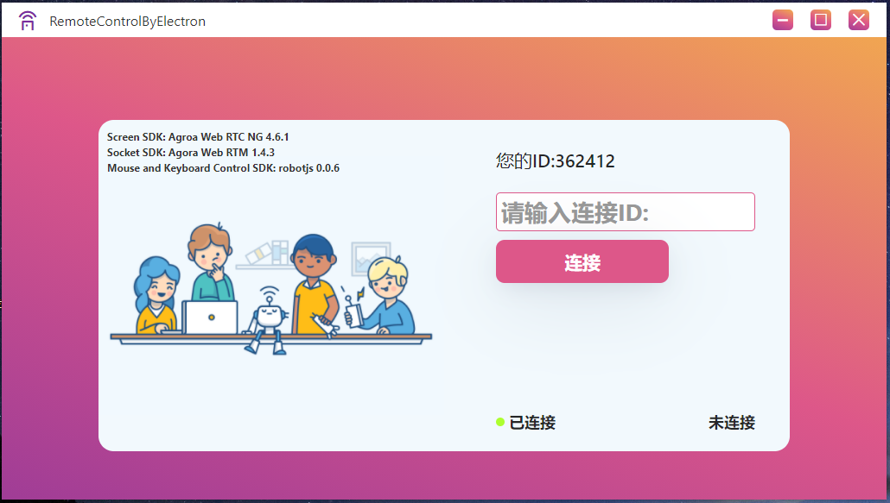

<p>
  RemoteControlByElectron uses <a href="https://electron.atom.io/">Electron</a>, <a href="https://facebook.github.io/react/">React</a>, <a href="https://github.com/reactjs/react-router">React Router</a>, <a href="https://webpack.js.org/">Webpack</a> and <a href="https://www.npmjs.com/package/react-refresh">React Fast Refresh</a>.
</p>
<br>


<br>


<br>

## Not Working with Timeline !
- keyboard not working!
- doubleClick not working!
- right-mouse button not working!
- mouse Areas overlap!
- sharescreen Time delay!
 
## Install

First, clone the repo via git and install dependencies:

```bash
git clone ******
cd your-project-name
yarn

// Maybe on Windows
cd src
npm install @codeporter/robotjs --build-from-source --runtime=electron --target_arch=ia32 --target=11.4.9 --dist-url=https://electronjs.org/headers
```

## Starting Development

Start the app in the `dev` environment:

```bash
yarn start
```

## Packaging for Production

To package apps for the local platform:

```bash
yarn package
```
